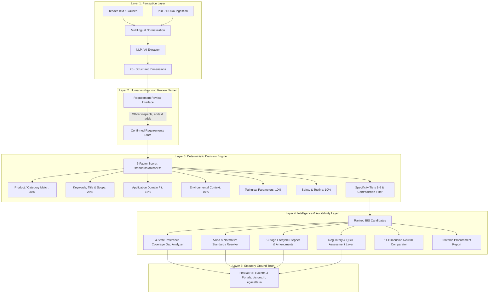
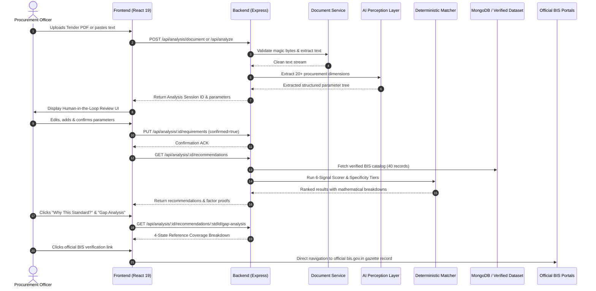

# ISutra — System Architecture & Technical Specification

> **AI Perception vs. Deterministic Decision Logic in High-Stakes Public Procurement**  
> *Smart India Hackathon (SIH) Problem Statement SIH26108*

---

## 1. Executive Summary & Design Principles

In government procurement, decisions directly impact public safety, infrastructural integrity, and statutory accountability under the **General Financial Rules (GFR, 2017)** and the **Central Vigilance Commission (CVC)** guidelines. An algorithmic recommendation engine that invents standards or guesses safety clauses exposes procurement authorities to severe legal and financial risks.

**ISutra** solves this through a fundamental architectural separation:

$$\text{\textbf{AI Perception Layer}} \longrightarrow \text{\textbf{Human-in-the-Loop Barrier}} \longrightarrow \text{\textbf{Deterministic Decision Engine}} \longrightarrow \text{\textbf{Official BIS Ground Truth}}$$

1. **AI Perception Layer**: Generative AI (Google Gemini 2.5 Flash, OpenAI GPT-4o-mini) and NLP parsers are used **only** to read unstructured text/PDFs and extract structured parameters.
2. **Strict Anti-Hallucination Guardrail**: AI models are **strictly forbidden** from generating standard numbers, fabricating safety clauses, inventing amendment dates, or issuing legal compliance certificates.
3. **Deterministic Decision Engine**: Recommendations are calculated using a transparent, reproducible, mathematical 6-factor linear model.
4. **End-to-End Auditability**: Every recommendation includes an unbroken 5-stage chain of custody linking the tender text directly to verified BIS gazette URLs.

---

## 2. Five-Layer System Architecture



---

## 3. Layer-by-Layer Detailed Specification

### Layer 1: Ingestion & Perception Layer
Handles diverse, unstructured inputs and normalizes them into structured engineering concepts.

- **Document Extraction Service** ([`documentExtractionService.ts`](file:///c:/Users/Eshwar%20Ajay%20Sai/Documents/ISutra/ISutra/backend/src/services/documentExtractionService.ts)):
  - Inspects file magic-bytes (`%PDF-`, `PK\x03\x04` for DOCX) to prevent malicious disguise attacks.
  - Extracts text streams preserving paragraph breaks and heading hierarchies.
  - Detects scanned image-only PDFs and safely rejects them with HTTP `422` and remediation instructions.
  - Dynamic OCR hook architecture (`ENABLE_OPTIONAL_OCR`) with provenance tracking (`isOcrDerived: boolean`).
- **Multilingual Normalization Layer** ([`multilingualService.ts`](file:///c:/Users/Eshwar%20Ajay%20Sai/Documents/ISutra/ISutra/backend/src/services/ai/multilingualService.ts)):
  - Performs Unicode script range detection for Devanagari (Hindi) and Telugu.
  - Maps Indic technical terms (e.g., *"स्ट्रीट लाइट ल्यूमिनेयर"*, *"స్ట్రీట్ లైట్ లూమినైర్"*) to canonical English taxonomy (`Luminaires`, `Roadway Lighting`) while preserving the original Indic source snippet.
  - Guarantees deterministic parity: An identical tender specification in English, Hindi, or Telugu produces the exact same standard recommendation score.
- **AI / NLP Parameter Extractor** ([`nlpExtractor.ts`](file:///c:/Users/Eshwar%20Ajay%20Sai/Documents/ISutra/ISutra/backend/src/services/ai/nlpExtractor.ts), [`aiClient.ts`](file:///c:/Users/Eshwar%20Ajay%20Sai/Documents/ISutra/ISutra/backend/src/services/ai/aiClient.ts)):
  - Dynamically routes requests across Google Gemini, OpenAI, or a built-in offline regex NLP engine.
  - Extracts 20+ structured procurement dimensions:
    - Core taxonomy: `product_name`, `category`, `subcategory`.
    - Operational context: `application_domain`, `operating_environment`, `installation_type`.
    - Quantitative specifications: `electrical_ratings`, `dimensional_limits`, `material_composition`.
    - Compliance parameters: `safety_features`, `testing_requirements`, `performance_metrics`.

---

### Layer 2: Human-in-the-Loop Review Barrier
Public procurement law requires that tender drafting officers take responsibility for specifications.

- **Review UI** ([`RequirementReviewPage.tsx`](file:///c:/Users/Eshwar%20Ajay%20Sai/Documents/ISutra/ISutra/frontend/src/pages/RequirementReviewPage.tsx)):
  - Displays the extracted parameter hierarchy with confidence indicators.
  - Allows officers to edit numerical values, delete misidentified terms, and add missing criteria.
  - Flags uncertain parameters with `needs_review`.
- **State Enforcement**: The backend controller ([`analysisController.ts`](file:///c:/Users/Eshwar%20Ajay%20Sai/Documents/ISutra/ISutra/backend/src/controllers/analysisController.ts)) guarantees that the recommendation engine **only reads from the confirmed requirement state**.

---

### Layer 3: Deterministic 6-Factor Decision Engine

The core scoring engine ([`standardsMatcher.ts`](file:///c:/Users/Eshwar%20Ajay%20Sai/Documents/ISutra/ISutra/backend/src/services/standardsMatcher.ts)) calculates a normalized relevance score ($S \in [0.0, 1.0]$) using a linear combination of six calibrated factors:

$$S = \sum_{i=1}^{6} w_i \cdot s_i = 0.30 \cdot s_1 + 0.25 \cdot s_2 + 0.15 \cdot s_3 + 0.10 \cdot s_4 + 0.10 \cdot s_5 + 0.10 \cdot s_6$$

#### Factor Weights & Evaluation Criteria:

```
┌────────────────────────────────────────────────────────────────────────┐
│                        FACTOR WEIGHT DISTRIBUTION                      │
│                                                                        │
│  [ Product / Category Match: 30% ] ──► Taxonomy & product classification│
│  [ Keywords, Title & Scope:  25% ] ──► Gazette title & published scope │
│  [ Application Domain Fit:   15% ] ──► Installation & environment      │
│  [ Environmental Context:    10% ] ──► Ingress, thermal, weather       │
│  [ Technical Parameters:     10% ] ──► Ratings, wattage, materials     │
│  [ Safety & Testing:         10% ] ──► Type tests, protection circuits │
└────────────────────────────────────────────────────────────────────────┘
```

1. **Product / Category Match ($w_1 = 0.30$)**:
   - $s_1 = 1.0$: Exact category match (e.g. `Luminaires` $\leftrightarrow$ `Luminaires`).
   - $s_1 = 0.5$: Subcategory / related family match.
   - $s_1 = 0.0$: No categorical alignment.
2. **Keywords, Title & Scope ($w_2 = 0.25$)**:
   - Jaccard similarity and semantic token matching between user terms and the standard's official Title and published BIS Scope statement.
3. **Application Domain Fit ($w_3 = 0.15$)**:
   - Compares deployment application (e.g. *Roadway/Street lighting* vs *Underground mining* vs *Floodlighting*).
4. **Environmental Context ($w_4 = 0.10$)**:
   - Evaluates ambient conditions (e.g., outdoor weather, high temperature, corrosive/saline, dust ingress).
5. **Technical Parameters ($w_5 = 0.10$)**:
   - Compares physical and electrical ratings (voltage, wattage, conductor cores, steel grade).
6. **Safety & Testing Specifications ($w_6 = 0.10$)**:
   - Validates safety features (surge protection, flame retardancy) and mandatory laboratory tests (type tests, routine tests).

#### Specificity Hierarchy (Tiers 1–6):
To prevent generic standards from outranking specific equipment standards:
- **Tier 1**: Exact Product-Type & Application Match (e.g., IS 10322 Part 5 Sec 3 for Street Lighting).
- **Tier 2**: Specific Subcategory Standard.
- **Tier 3**: Broad Equipment Family Standard (e.g., IS 10322 Part 1 General Luminaire Requirements).
- **Tier 4**: Allied Normative Reference.
- **Tier 5**: General Test Method Standard (e.g., IS 10810 series for Cable Testing).
- **Tier 6**: Cross-Domain Generic Standard (e.g., IS/IEC 60529 Ingress Protection).

#### Contradiction Handling & Product-Form Conflicts:
When user requirements specify an application (e.g., *Outdoor Highway Roadway*), standards explicitly restricted to incompatible forms (e.g., *Underground Coal Mining Luminaires*) receive a severe contradiction penalty:
$$s_{\text{application}} = 0.0, \quad \text{status} = \text{'contradiction'}$$
This prevents misleading high scores caused by generic keyword matches.

---

### Layer 4: Intelligence & Auditability Layer

#### 1. The 5-Stage Audit Traceability Chain
Every recommendation includes an unbroken audit trail:
$$\text{User Input} \longrightarrow \text{Extracted Requirement} \longrightarrow \text{Scoring Signal} \longrightarrow \text{Standard Clause} \longrightarrow \text{Official BIS URL}$$

#### 2. Four-State Reference Coverage Taxonomy
Implemented in [`requirementGapAnalyzer.ts`](file:///c:/Users/Eshwar%20Ajay%20Sai/Documents/ISutra/ISutra/backend/src/services/requirementGapAnalyzer.ts):
- `supported`: Confirmed present in verified clauses.
- `not_supported`: Contradicted by standard scope.
- `not_available`: Dimension is outside the standard's scope (e.g., safety standard does not govern photometric efficiency).
- `needs_verification`: Parameter requires manual inspection in the complete physical standard.

#### 3. Allied Standards Explorer
Implemented in [`standardsRelationshipService.ts`](file:///c:/Users/Eshwar%20Ajay%20Sai/Documents/ISutra/ISutra/backend/src/services/standardsRelationshipService.ts):
- Resolves normative references, test methods, safety codes, and installation guides.
- Distinguishes **Verified Relationships** (backed by explicit clause citations and official URLs) from **Unclassified References**.

#### 4. Standards Lifecycle & Gazette Stepper
Implemented in [`standardLifecycleService.ts`](file:///c:/Users/Eshwar%20Ajay%20Sai/Documents/ISutra/ISutra/backend/src/services/standardLifecycleService.ts):
- 5-stage stepper: `STANDARD` $\rightarrow$ `REVISION` $\rightarrow$ `AMENDMENT` $\rightarrow$ `REAFFIRMATION` $\rightarrow$ `VERIFIED PORTAL`.
- Tracks periodic 5-year reaffirmations by BIS sectional committees.

#### 5. Regulatory & Certification Engine
Implemented in [`regulatoryService.ts`](file:///c:/Users/Eshwar%20Ajay%20Sai/Documents/ISutra/ISutra/backend/src/services/regulatoryService.ts):
- Evaluates mandatory **Quality Control Orders (QCOs)** issued by Ministries under the BIS Act 2016.
- Returns strictly 3 states: `VERIFIED APPLICABILITY`, `VERIFICATION REQUIRED`, or `NO VERIFIED REGULATORY RECORD`.

#### 6. Neutral Multi-Dimensional Standard Comparison
Implemented in [`standardsComparator.ts`](file:///c:/Users/Eshwar%20Ajay%20Sai/Documents/ISutra/ISutra/backend/src/services/standardsComparator.ts):
- Compares 2 or 3 standards across 11 objective dimensions without subjective rankings.

---

### Layer 5: Statutory Ground Truth
- Connects directly to official portals:
  - BIS Standards Portal: `https://services.bis.gov.in`
  - BIS Know Your Standards: `https://www.services.bis.gov.in/php/BIS_2.0/bisconnect/knowyourstandards/`
  - Gazette of India: `https://egazette.gov.in`
  - MeitY CRS: `https://crsbis.in`
- Every recommended standard displays direct hyperlinks to official source records.

---

## 4. Ingestion Schema & Verification Protocol

Implemented in [`standardsIngestionService.ts`](file:///c:/Users/Eshwar%20Ajay%20Sai/Documents/ISutra/ISutra/backend/src/services/standardsIngestionService.ts):

```typescript
export interface StandardIngestionPayload {
  id: string;               // e.g. "is-10322-5-3"
  standard_number: string;  // e.g. "IS 10322 (Part 5/Sec 3): 2012"
  title: string;            // Official BIS Title
  category: string;         // Canonical Category
  scope: string;            // Non-empty official scope statement
  source_url: string;       // Strict https://*.gov.in or https://*.crsbis.in URL
  last_verified: string;    // ISO 8601 UTC timestamp
  status: 'active' | 'withdrawn' | 'superseded' | 'under_revision';
}
```

Records that fail government domain verification, contain invalid standard syntax, or lack verification dates are strictly rejected.

---

## 5. Sequence Diagram: Complete Recommendation Flow


